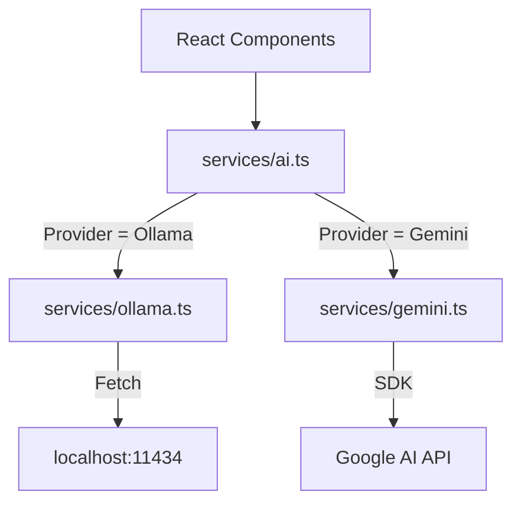

# AI Services & Usage Guide

## Hybrid AI Architecture

EduGenie AI uses a unified service layer (`services/ai.ts`) that dynamically delegates requests to either **Ollama** (local) or **Gemini** (cloud) based on your preference.

### Architecture Overview

## Supported Features

### 1. Study Chatbot (Explainer)
-   **Streaming Support**: Both providers support real-time text streaming for a natural conversation feel.
-   **Context Awareness**: Maintains conversation history for follow-up questions.

### 2. Flashcards & Quizzes
-   **Customizable**: Generate **5 to 100** items per request.
-   **Structured Data**: Uses JSON mode to ensure perfect formatting for app integration.

### 3. Note Summarizer
-   **Text Summarization**: Condenses long notes into bullet points.
-   **Vision Capabilities**:
    -   **Ollama**: Uses `llava` model to read text from images.
    -   **Gemini**: Uses mutimodal capabilities for high-accuracy OCR.

### 4. Image Generation (Hugging Face)
-   **Integration**: Automatic companion images for Flashcards and Quiz questions.
-   **Model**: `stabilityai/stable-diffusion-xl-base-1.0`.
-   **Requirement**: Requires `HUGGINGFACE_API_KEY` in `.env.local`.

## 🛠 Troubleshooting

### Common Ollama Issues

**"Failed to connect to Ollama"**
-   Is Ollama running? Run `ollama serve`.
-   Is it blocked by firewall? Check port 11434.

**"Model not found"**
-   Did you pull the models? Run `ollama pull llama3.2`.

**"Response is slow"**
-   Use a smaller model (`phi3` or `llama3.2`).
-   Close background apps to free up RAM.

### Common Gemini Issues

**"API Key Invalid"**
-   Check `.env.local` for typos.
-   Ensure you haven't exceeded free tier quotas.

**"Safety Block"**
-   Gemini has strict safety filters. Use Ollama for unrestricted research topics if needed.

## 🔧 Developer Notes

### Adding New Providers
To add a new provider (e.g., OpenAI):
1.  Create `services/openai.ts`.
2.  Add `'openai'` to `AIProvider` type in `services/aiSettings.ts`.
3.  Update switch cases in `services/ai.ts`.
4.  Add button in `Sidebar.tsx`.
